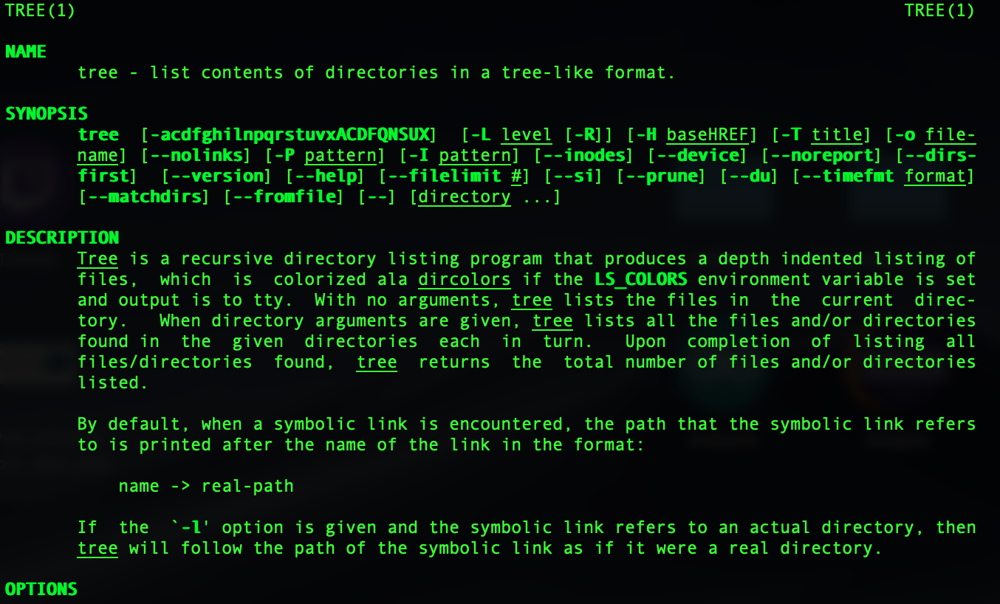
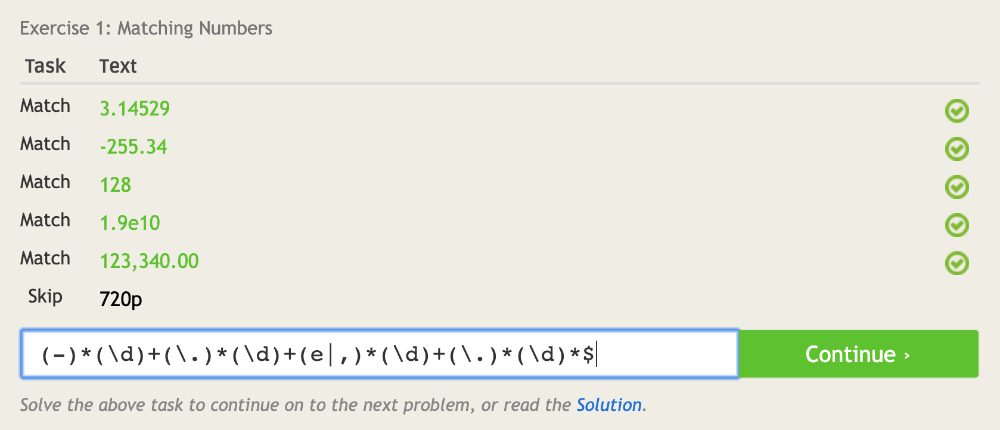
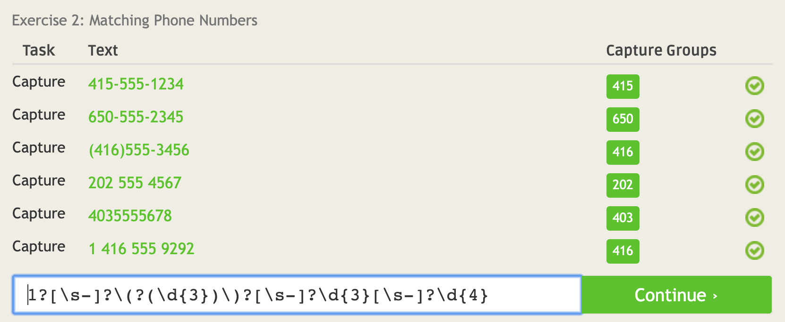
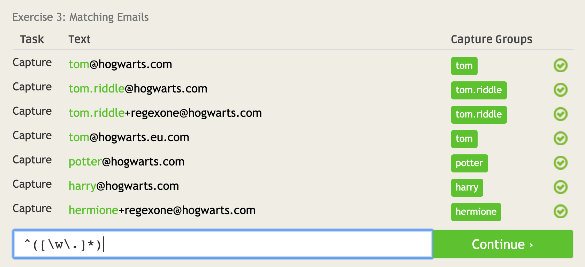
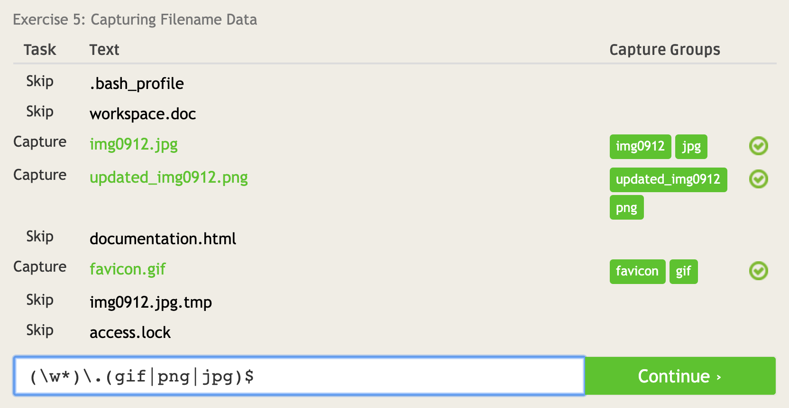
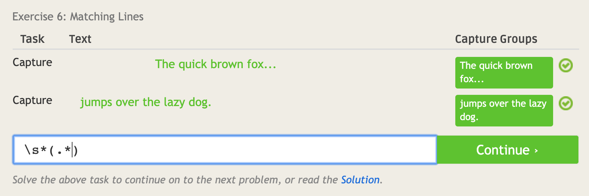
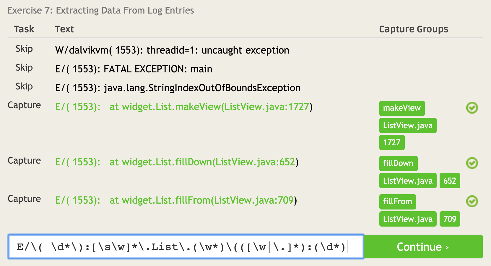
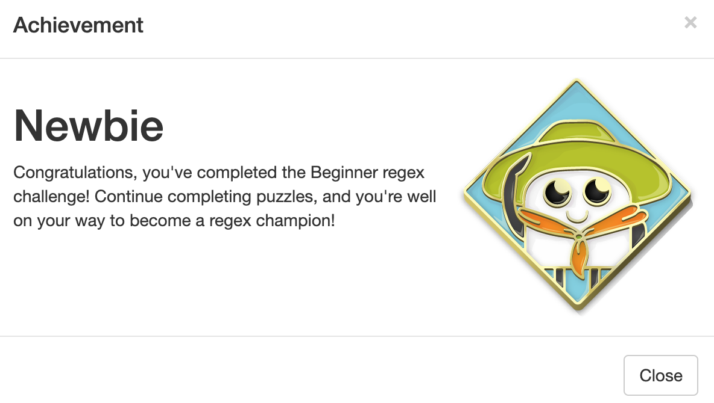
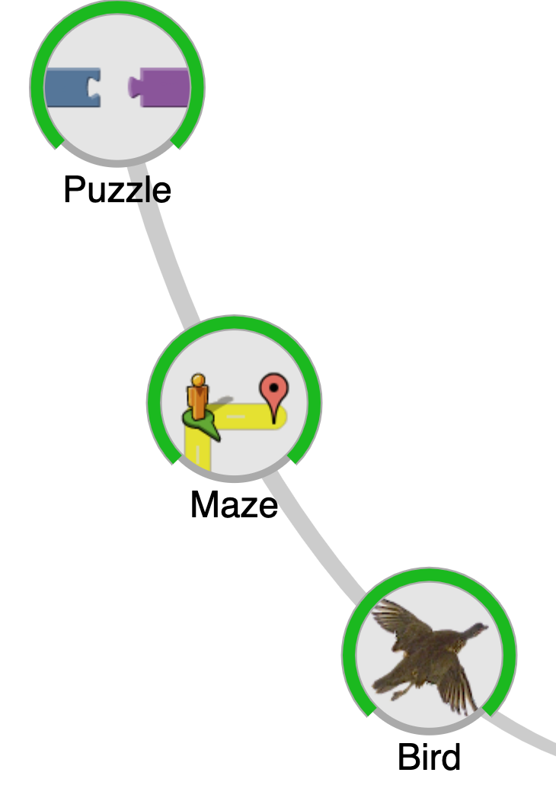

# Lab 01 Report - Introduction to Open Source Software

## Open Source Definition
> Open source software must satisfy the following requirements: free redistribution, unobfuscated source code, allowance for derivative code, no discrimination against people or fields, license must not be applied to a specific product, license must not restrict other software, and license ust be tech neutral

 ## Eric Raymond's Smart Questions
 > This article boils down to be polite, be specific, be detailed, be concise, and genuinely look for answers before blindly asking for help.
 > Two more suggestions to answer questions in a helpful way:\
 > 1) Answer to the level of the asker. If they are a beginner, avoid jargon, etc.\
 > 2) Upvote other answers that are correct or helpful.\
 
 ## Free Culture Chapter 3
 > This article emphasizes the importance of information freedom. When certain organizations and corporations own intellectual properties or ideas, they are given legal license to bully small players in innovation. This impedes the development of technology, and allows well-funded players to use their ownership as an excuse to squeeze profit out of an unfair system that puts individuals at a disadvantage. It seems that the driver for ownership is money, not the progression and distribution of technology. Not such a noble cause.

## Tree Man Page

## Regular Expressions Problems

## Regular Expression Corssword Problems

## Blockly Problem

## Reflection
One Open Source project I'm interested in is called OpenStreetMap. It's a webapp that creates a map of data about roads, trails, cafés, railway stations, and much more, all over the world. They do this using public contributions, aerial imagery, GPS devices, and low-tech field maps to verify that OSM is accurate and up to date. This Open Source project looks interesting because I think I can use it for my RCOS project, the Forge Machines map.
