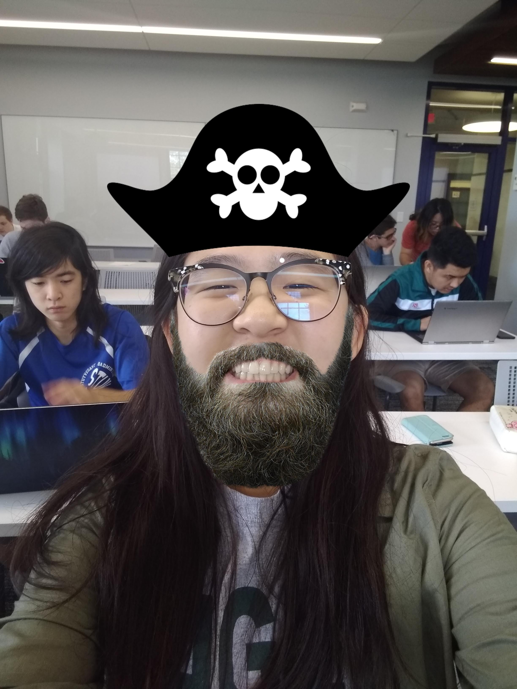
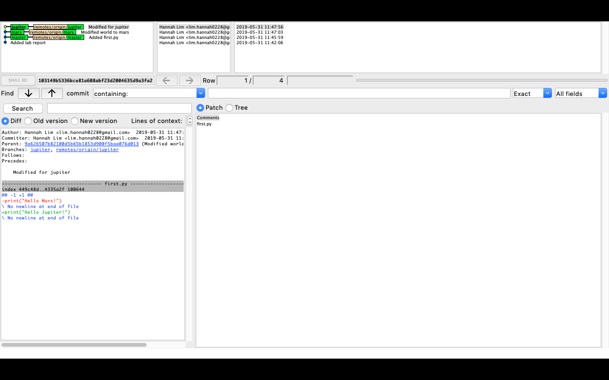
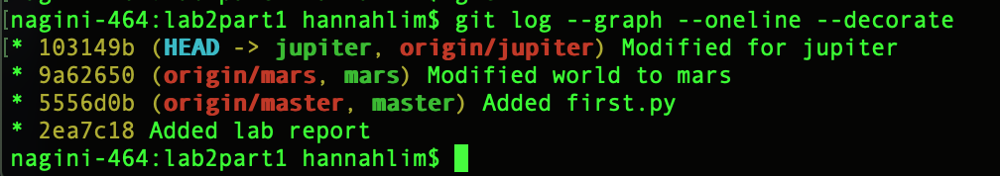
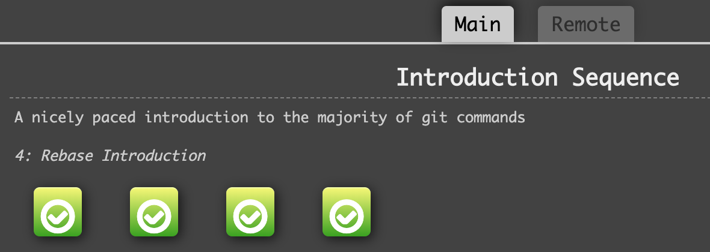
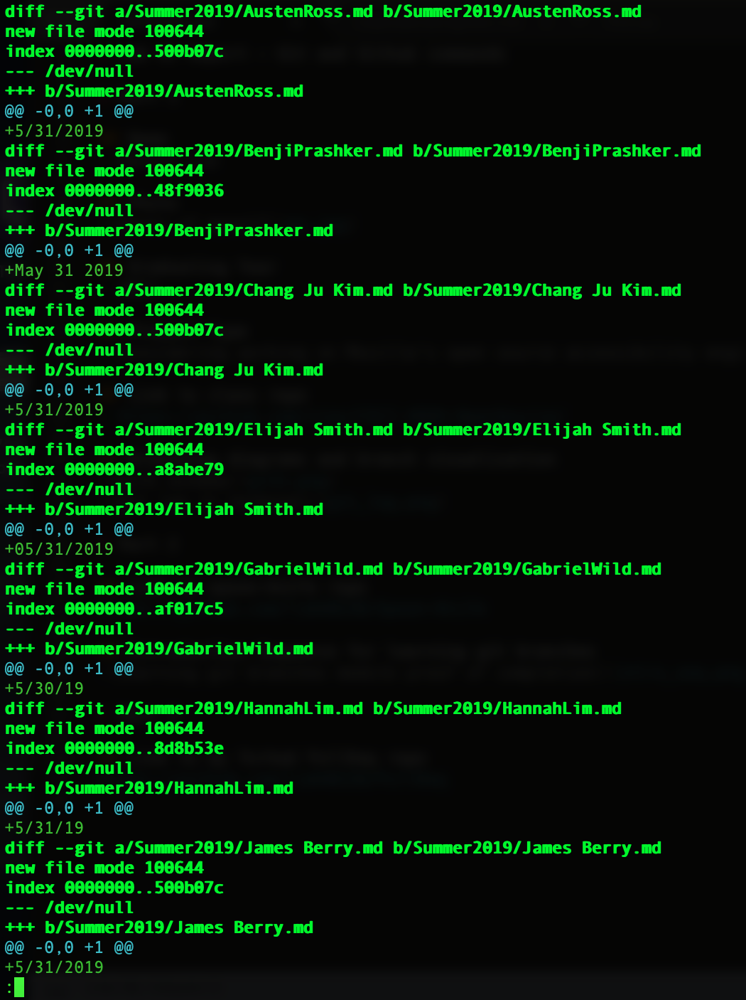
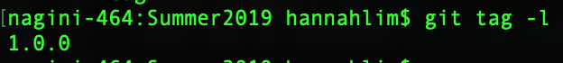

# Lab 02 Report - Git and Github commands

# Part 1

## Name
> Hananh Lim

## Photo

## Graduating Year
> 2021

## Project Type
> Considering working on Mozilla's open source accessibility engine, Gecko.

## Link to class repo
> https://github.com/rcos/CSCI-49XX-OpenSource/

## Branching diagrams and branch visualization

 
# Part 2

## Link to spoon-knife repo
> https://github.com/limh0228/Spoon-Knife

## Introduction Sequence for learning git branches

# Part 3

## Link to my forked PullReq repo
> https://github.com/limh0228/PullReq

## Git diff in terminal

## git tag -l

## Link to common table repository
> https://github.com/prashb99/OSSProjectIdeas
