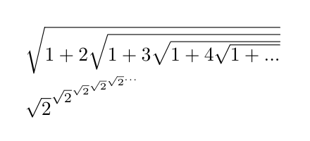
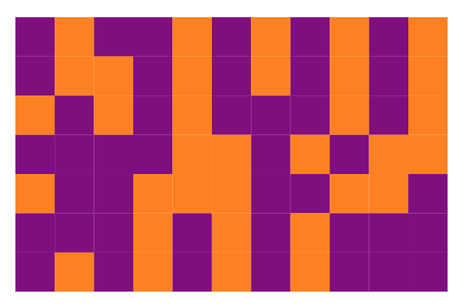
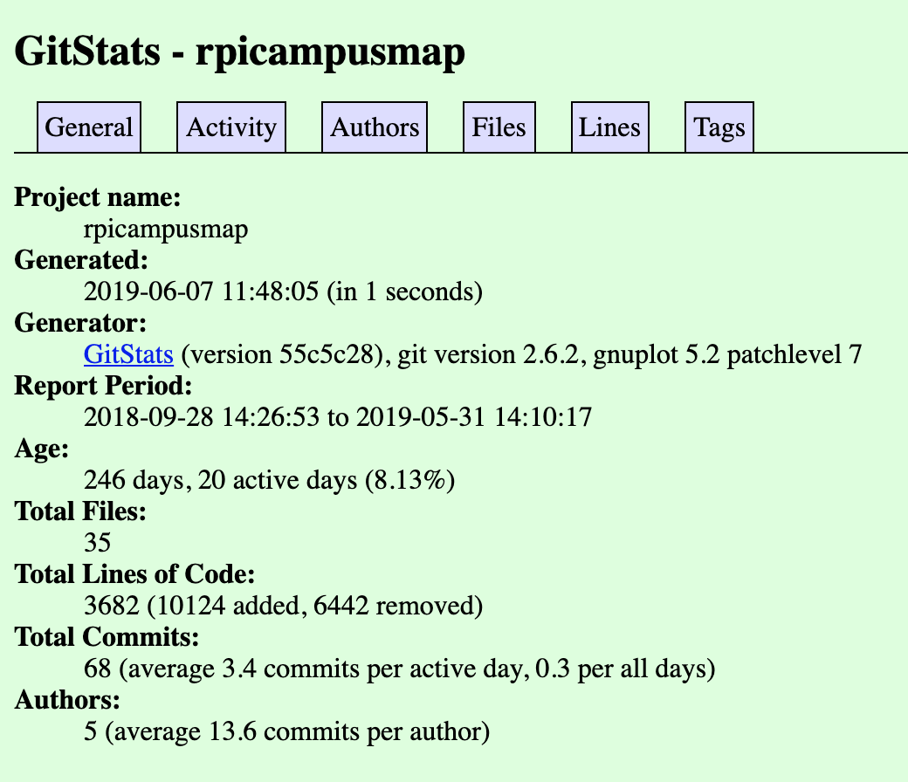
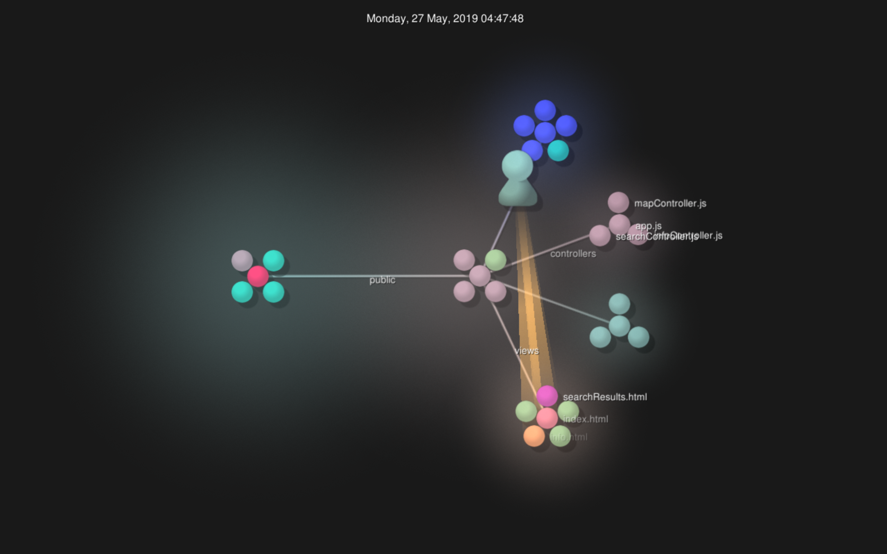

# Lab 3 Write Up

## Latex Formulae

## Hadamard Matrix

## RCOS Project Information 
#### Campus Map

###### Terminal results: 
> Number of contributors: 6\
> Number of lines of code: 18198\
> First commit: September 28 2018\
> Latest commit: May 31, 2019\
> Current branches: master, production, dev, forgemill-dev, forgemill

###### Gitstats results:
> Number of contributors: 5\
> Lines of code: 3682\
> First commit: September 28 2018\
> Last commit: May 31, 2019

#### Runelite

###### Terminal results:
> Contributors: 334\
> Lines of code: 48074\
> First commit: November 30, 2014\
> Latest commit: January 6, 2019\
> Current branches: Master

#### RPICourseTrends

###### Terminal results:
> Number of Contributors: 5\
> Lines of Code: 181974\
> First Commit: September 7th, 2018\
> Last Commit: April 17th, 2019\
> Number of Branches: 2

#### RPEye

###### Terminal results:
> Contributors: 18\
> Lines: 300061\
> First commit: October 1, 2018\
> Last Commiut: January 22, 2019\
> Current branches: master, UI-UX, Text-Transformation, Ranking, Link-Analysis, Indexing, Crawler

###### Gitstats results:
> Contributors: 20\
> Lines of code: 203309\
> First commit: 2018-10-01\
> Last commit: 2019-01-22

## Gource results

> Video gource.mp4 is included in lab folder
 