## Week 5 Lab Number 5, 6/21/2019 Friday - Build Systems

### Step 1

> Modified code for tutorial.cxx
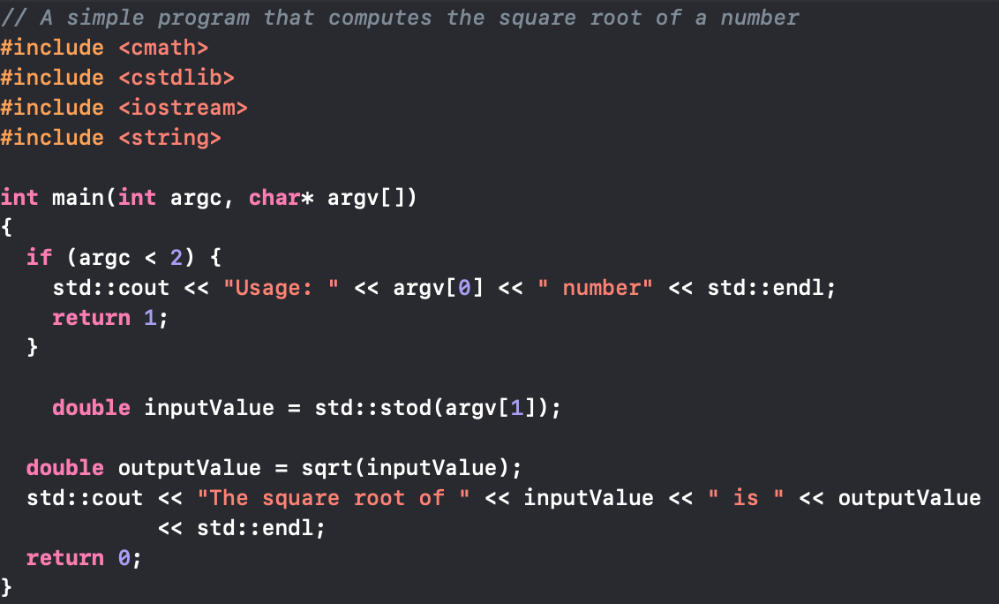
> Modified code for CMakeLists.txt
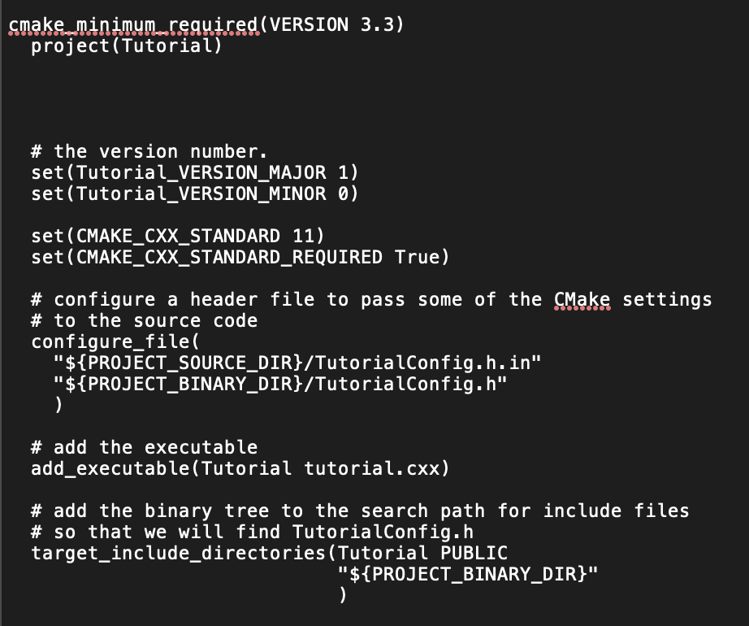
> Screen shot of running the Tutorial code without input, with 10 and with 4294967296
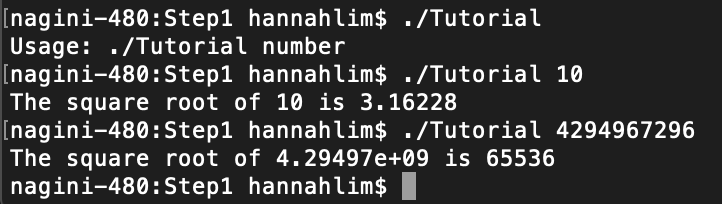

### Step 2

> Modified code for tutorial.cxx
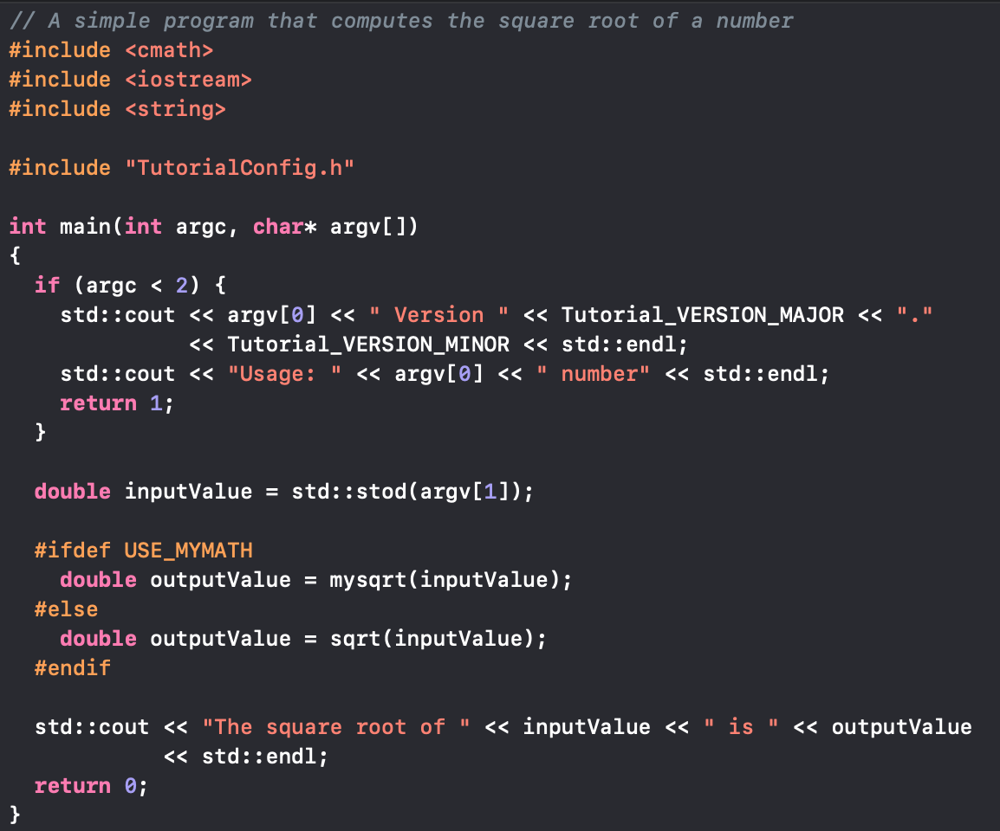
> Modified code for CMakeLists.txt
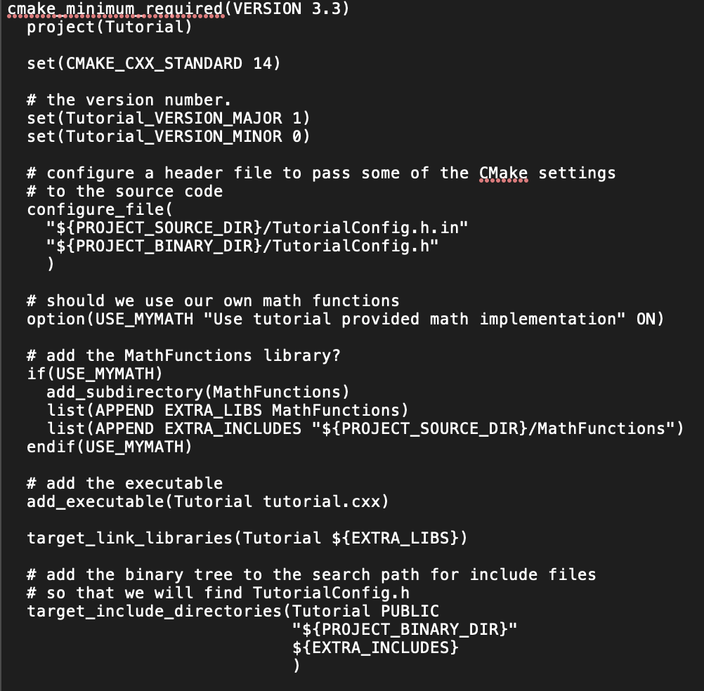
> Screen shot of running the Tutorial code without input, with 10 and with 4294967296
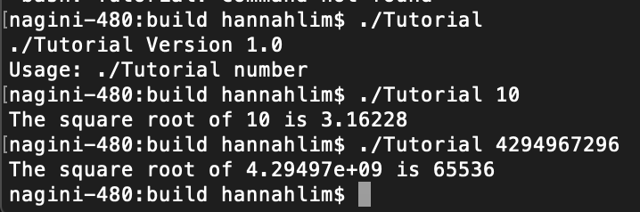

### Step 3

> Modified code for CMakeLists.txt
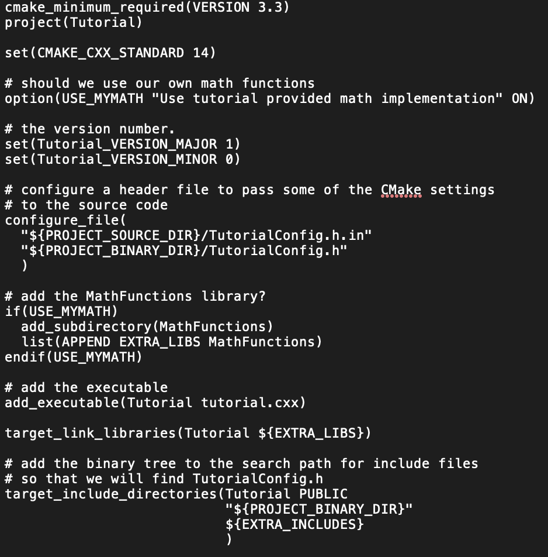
> Modified code for MathFunctions/CMakeLists.txt

> Screen shot of running the Tutorial code without input, with 10 and with 4294967296
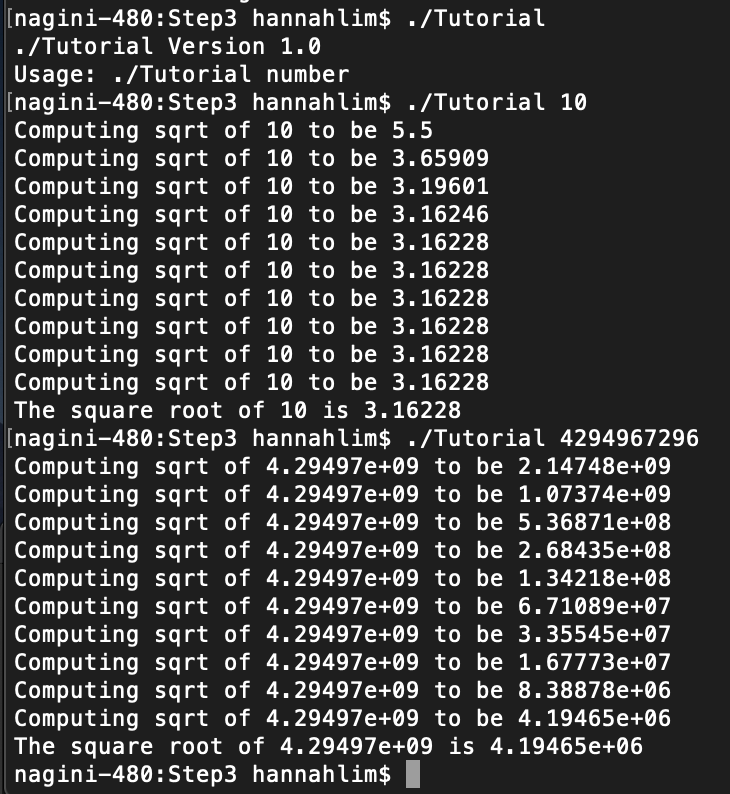

### Step 4
> Modified code for CMakeLists.txt

> Modified code for MathFunctions/CMakeLists.txt

> Screenshot of output of running ctest -VV in terminal
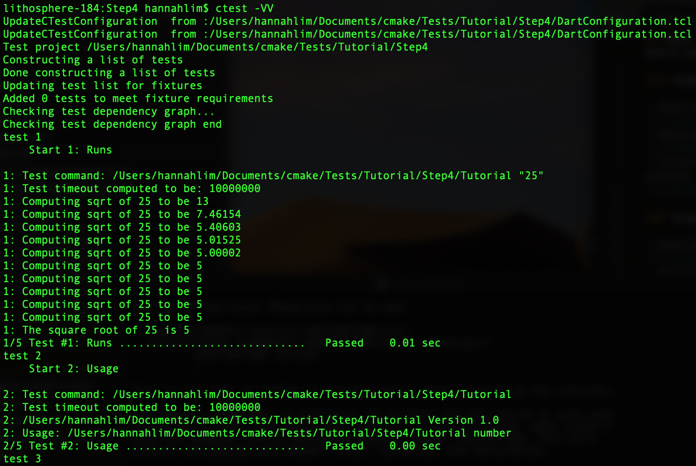
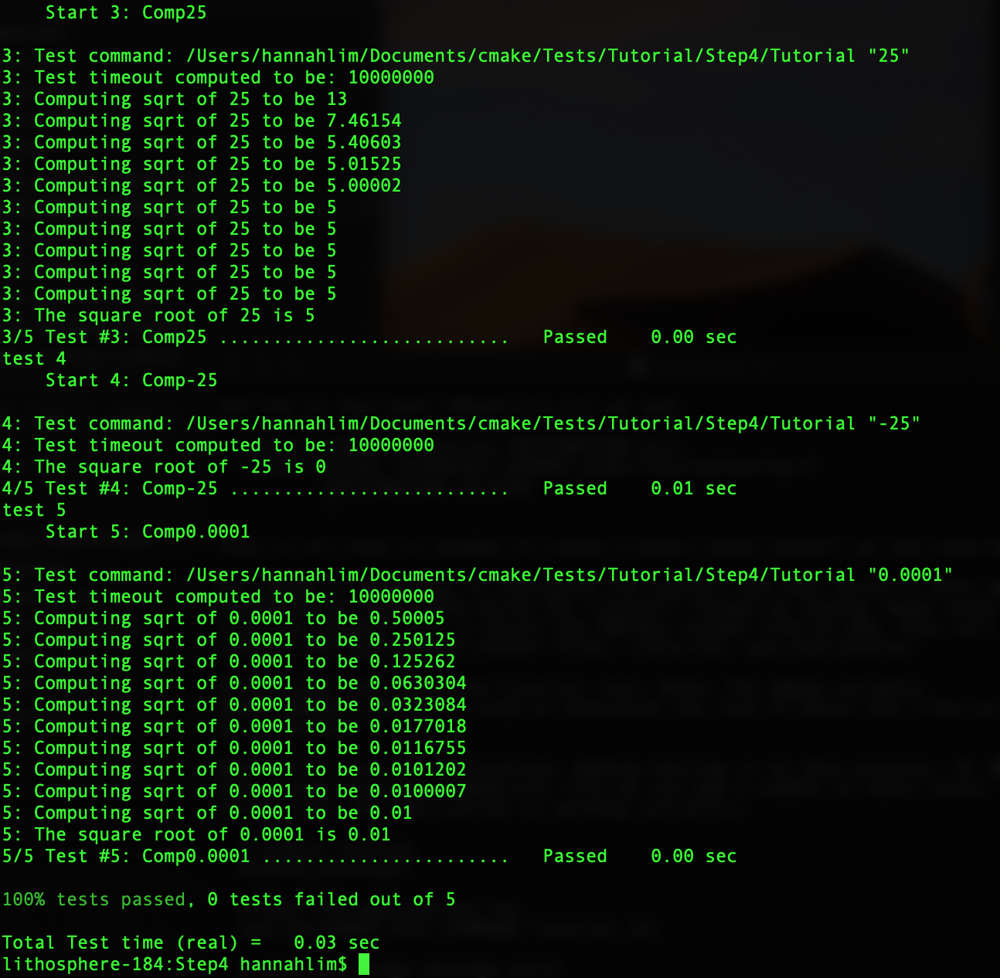

### Step 5

> Modified code for CMakeLists.txt
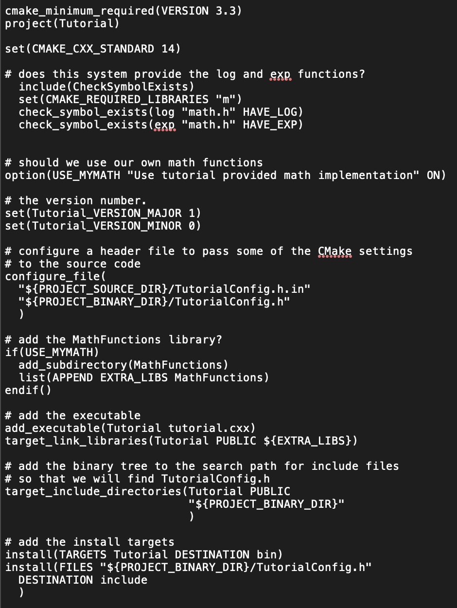
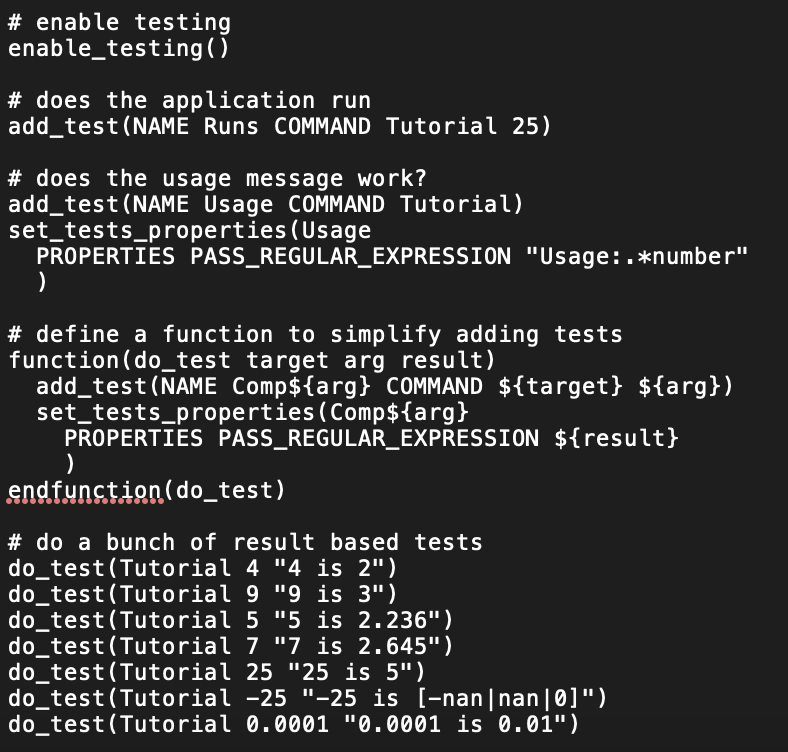
> Modified code for MathFunctions/CMakeLists.txt

> Screen shot of running the Tutorial code without input, with 10 and with 4294967296
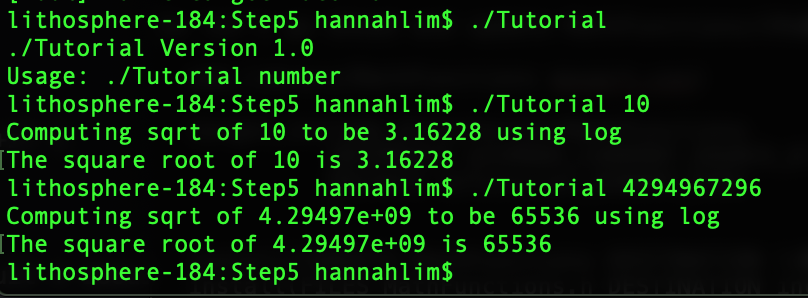

