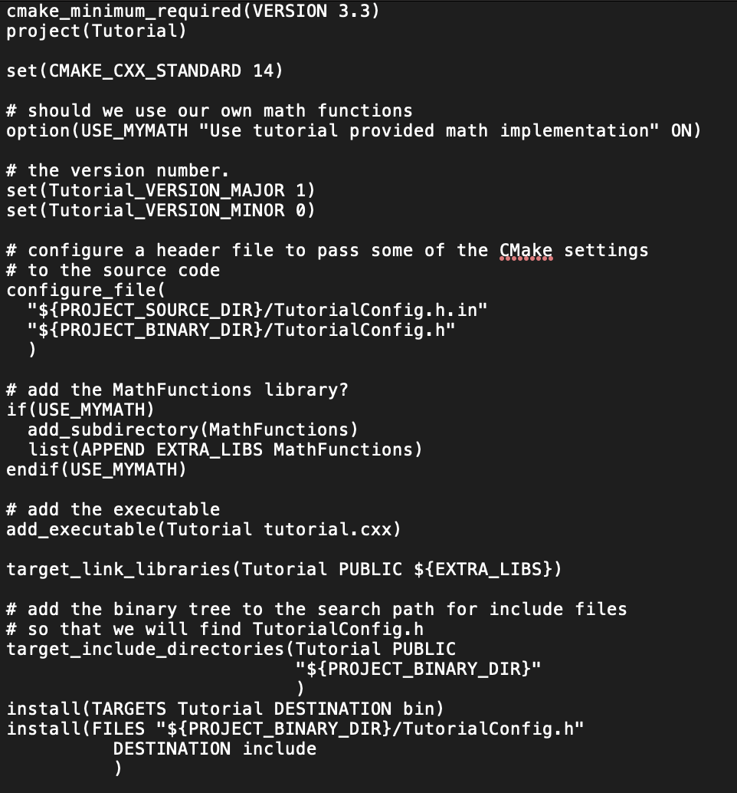

## Week 5 Lab Number 5, 6/21/2019 Friday - Build Systems

## Lab Part 1

### Step 1

> Modified code for tutorial.cxx

> Modified code for CMakeLists.txt

> Screen shot of running the Tutorial code without input, with 10 and with 4294967296

### Step 2

> Modified code for tutorial.cxx

> Modified code for CMakeLists.txt

> Screen shot of running the Tutorial code without input, with 10 and with 4294967296

### Step 3

> Modified code for CMakeLists.txt

> Modified code for MathFunctions/CMakeLists.txt

> Screen shot of running the Tutorial code without input, with 10 and with 4294967296

### Step 4
> Modified code for CMakeLists.txt

> Modified code for MathFunctions/CMakeLists.txt

> Screenshot of output of running ctest -VV in terminal

### Step 5

> Modified code for CMakeLists.txt

> Modified code for MathFunctions/CMakeLists.txt

> Screen shot of running the Tutorial code without input, with 10 and with 4294967296

## Lab Part 2

### Makefile

all: static_block dynamic_block

static_block: program.o staticlib.a
	cc program.o staticlib.a -o static_block

dynamic_block: program.o dynlib.so
	cc program.o dynlib.so -o dynamic_block -Wl,-rpath='$$ORIGIN'

program.o: program.c
	cc -c program.c

block.o: source/block.c
	cc -c source/block.c

dynlib.so: block.o
	cc -shared -o dynlib.so block.o

staticlib.a: block.o
	ar qc staticlib.a block.o

### CMakefile

cmake_minimum_required(VERSION 3.0)
project(Block C)

add_library(staticlib source/block.c)
add_library(dynlib SHARED source/block.c)

add_executable(static_block program.c)
add_executable(dynamic_block program.c)

target_link_libraries(static_block staticlib)
target_link_libraries(dynamic_block dynlib)

### the Makefile created by cmake

\# CMAKE generated file: DO NOT EDIT!
\# Generated by "Unix Makefiles" Generator, CMake Version 3.14

\# Default target executed when no arguments are given to make.
default_target: all

.PHONY : default_target

\# Allow only one "make -f Makefile2" at a time, but pass parallelism.
.NOTPARALLEL:

\#=============================================================================
\# Special targets provided by cmake.

\# Disable implicit rules so canonical targets will work.
.SUFFIXES:

\# Remove some rules from gmake that .SUFFIXES does not remove.
SUFFIXES =

.SUFFIXES: .hpux_make_needs_suffix_list

\# Suppress display of executed commands.
$(VERBOSE).SILENT:

\# A target that is always out of date.
cmake_force:

.PHONY : cmake_force

\#=============================================================================
\# Set environment variables for the build.

\# The shell in which to execute make rules.
SHELL = /bin/sh

\# The CMake executable.
CMAKE_COMMAND = /usr/local/Cellar/cmake/3.14.5/bin/cmake

\# The command to remove a file.
RM = /usr/local/Cellar/cmake/3.14.5/bin/cmake -E remove -f

\# Escaping for special characters.
EQUALS = =

\# The top-level source directory on which CMake was run.
CMAKE_SOURCE_DIR = /Users/hannahlim/Documents/oss-repo/labs/lab-05

\# The top-level build directory on which CMake was run.
CMAKE_BINARY_DIR = /Users/hannahlim/Documents/oss-repo/labs/lab-05

\#=============================================================================
\# Targets provided globally by CMake.

\# Special rule for the target edit_cache
edit_cache:
	@$(CMAKE_COMMAND) -E cmake_echo_color --switch=$(COLOR) --cyan "Running CMake cache editor..."
	/usr/local/Cellar/cmake/3.14.5/bin/ccmake -S$(CMAKE_SOURCE_DIR) -B$(CMAKE_BINARY_DIR)
.PHONY : edit_cache

\# Special rule for the target edit_cache
edit_cache/fast: edit_cache

.PHONY : edit_cache/fast

\# Special rule for the target rebuild_cache
rebuild_cache:
	@$(CMAKE_COMMAND) -E cmake_echo_color --switch=$(COLOR) --cyan "Running CMake to regenerate build system..."
	/usr/local/Cellar/cmake/3.14.5/bin/cmake -S$(CMAKE_SOURCE_DIR) -B$(CMAKE_BINARY_DIR)
.PHONY : rebuild_cache

\# Special rule for the target rebuild_cache
rebuild_cache/fast: rebuild_cache

.PHONY : rebuild_cache/fast

\# The main all target
all: cmake_check_build_system
	$(CMAKE_COMMAND) -E cmake_progress_start /Users/hannahlim/Documents/oss-repo/labs/lab-05/CMakeFiles /Users/hannahlim/Documents/oss-repo/labs/lab-05/CMakeFiles/progress.marks
	$(MAKE) -f CMakeFiles/Makefile2 all
	$(CMAKE_COMMAND) -E cmake_progress_start /Users/hannahlim/Documents/oss-repo/labs/lab-05/CMakeFiles 0
.PHONY : all

\# The main clean target
clean:
	$(MAKE) -f CMakeFiles/Makefile2 clean
.PHONY : clean

\# The main clean target
clean/fast: clean

.PHONY : clean/fast

\# Prepare targets for installation.
preinstall: all
	$(MAKE) -f CMakeFiles/Makefile2 preinstall
.PHONY : preinstall

\# Prepare targets for installation.
preinstall/fast:
	$(MAKE) -f CMakeFiles/Makefile2 preinstall
.PHONY : preinstall/fast

\# clear depends
depend:
	$(CMAKE_COMMAND) -S$(CMAKE_SOURCE_DIR) -B$(CMAKE_BINARY_DIR) --check-build-system CMakeFiles/Makefile.cmake 1
.PHONY : depend

\#=============================================================================
\# Target rules for targets named static_block

\# Build rule for target.
static_block: cmake_check_build_system
	$(MAKE) -f CMakeFiles/Makefile2 static_block
.PHONY : static_block

\# fast build rule for target.
static_block/fast:
	$(MAKE) -f CMakeFiles/static_block.dir/build.make CMakeFiles/static_block.dir/build
.PHONY : static_block/fast

\#=============================================================================
\# Target rules for targets named dynamic_block

\# Build rule for target.
dynamic_block: cmake_check_build_system
	$(MAKE) -f CMakeFiles/Makefile2 dynamic_block
.PHONY : dynamic_block

\# fast build rule for target.
dynamic_block/fast:
	$(MAKE) -f CMakeFiles/dynamic_block.dir/build.make CMakeFiles/dynamic_block.dir/build
.PHONY : dynamic_block/fast

\#=============================================================================
\# Target rules for targets named dynlib

\# Build rule for target.
dynlib: cmake_check_build_system
	$(MAKE) -f CMakeFiles/Makefile2 dynlib
.PHONY : dynlib

\# fast build rule for target.
dynlib/fast:
	$(MAKE) -f CMakeFiles/dynlib.dir/build.make CMakeFiles/dynlib.dir/build
.PHONY : dynlib/fast

\#=============================================================================
\# Target rules for targets named staticlib

\# Build rule for target.
staticlib: cmake_check_build_system
	$(MAKE) -f CMakeFiles/Makefile2 staticlib
.PHONY : staticlib

\# fast build rule for target.
staticlib/fast:
	$(MAKE) -f CMakeFiles/staticlib.dir/build.make CMakeFiles/staticlib.dir/build
.PHONY : staticlib/fast

program.o: program.c.o

.PHONY : program.o

\# target to build an object file
program.c.o:
	$(MAKE) -f CMakeFiles/static_block.dir/build.make CMakeFiles/static_block.dir/program.c.o
	$(MAKE) -f CMakeFiles/dynamic_block.dir/build.make CMakeFiles/dynamic_block.dir/program.c.o
.PHONY : program.c.o

program.i: program.c.i

.PHONY : program.i

\# target to preprocess a source file
program.c.i:
	$(MAKE) -f CMakeFiles/static_block.dir/build.make CMakeFiles/static_block.dir/program.c.i
	$(MAKE) -f CMakeFiles/dynamic_block.dir/build.make CMakeFiles/dynamic_block.dir/program.c.i
.PHONY : program.c.i

program.s: program.c.s

.PHONY : program.s

\# target to generate assembly for a file
program.c.s:
	$(MAKE) -f CMakeFiles/static_block.dir/build.make CMakeFiles/static_block.dir/program.c.s
	$(MAKE) -f CMakeFiles/dynamic_block.dir/build.make CMakeFiles/dynamic_block.dir/program.c.s
.PHONY : program.c.s

source/block.o: source/block.c.o

.PHONY : source/block.o

\# target to build an object file
source/block.c.o:
	$(MAKE) -f CMakeFiles/dynlib.dir/build.make CMakeFiles/dynlib.dir/source/block.c.o
	$(MAKE) -f CMakeFiles/staticlib.dir/build.make CMakeFiles/staticlib.dir/source/block.c.o
.PHONY : source/block.c.o

source/block.i: source/block.c.i

.PHONY : source/block.i

\# target to preprocess a source file
source/block.c.i:
	$(MAKE) -f CMakeFiles/dynlib.dir/build.make CMakeFiles/dynlib.dir/source/block.c.i
	$(MAKE) -f CMakeFiles/staticlib.dir/build.make CMakeFiles/staticlib.dir/source/block.c.i
.PHONY : source/block.c.i

source/block.s: source/block.c.s

.PHONY : source/block.s

\# target to generate assembly for a file
source/block.c.s:
	$(MAKE) -f CMakeFiles/dynlib.dir/build.make CMakeFiles/dynlib.dir/source/block.c.s
	$(MAKE) -f CMakeFiles/staticlib.dir/build.make CMakeFiles/staticlib.dir/source/block.c.s
.PHONY : source/block.c.s

\# Help Target
help:
	@echo "The following are some of the valid targets for this Makefile:"
	@echo "... all (the default if no target is provided)"
	@echo "... clean"
	@echo "... depend"
	@echo "... edit_cache"
	@echo "... static_block"
	@echo "... dynamic_block"
	@echo "... rebuild_cache"
	@echo "... dynlib"
	@echo "... staticlib"
	@echo "... program.o"
	@echo "... program.i"
	@echo "... program.s"
	@echo "... source/block.o"
	@echo "... source/block.i"
	@echo "... source/block.s"
.PHONY : help

\#=============================================================================
\# Special targets to cleanup operation of make.

\# Special rule to run CMake to check the build system integrity.
\# No rule that depends on this can have commands that come from listfiles
\# because they might be regenerated.
cmake_check_build_system:
	$(CMAKE_COMMAND) -S$(CMAKE_SOURCE_DIR) -B$(CMAKE_BINARY_DIR) --check-build-system CMakeFiles/Makefile.cmake 0
.PHONY : cmake_check_build_system

### the relative size of the two executables

### Results of running the program

