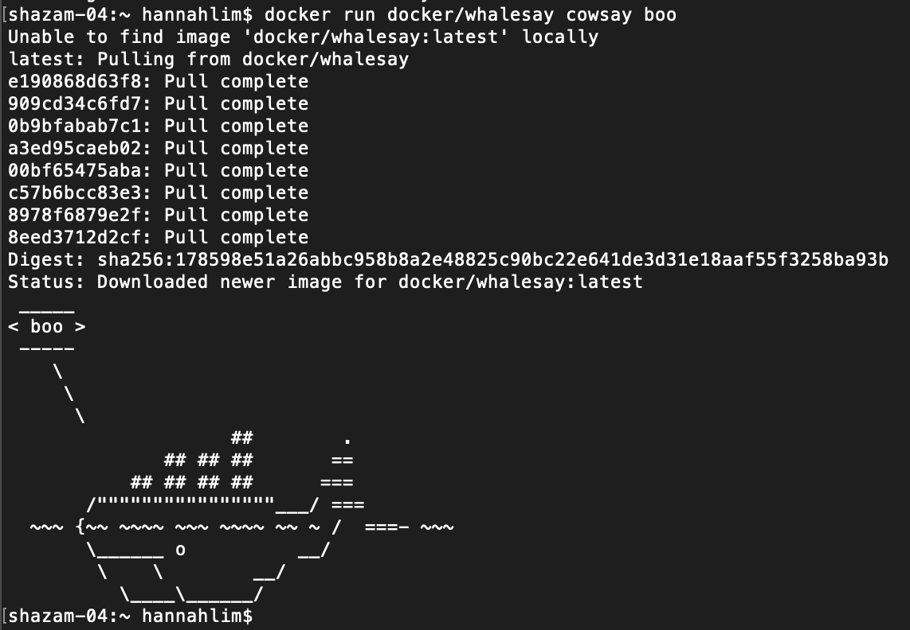
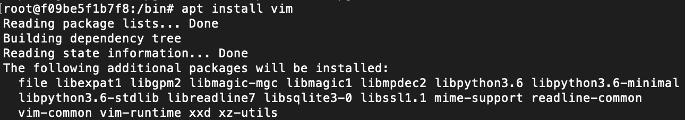
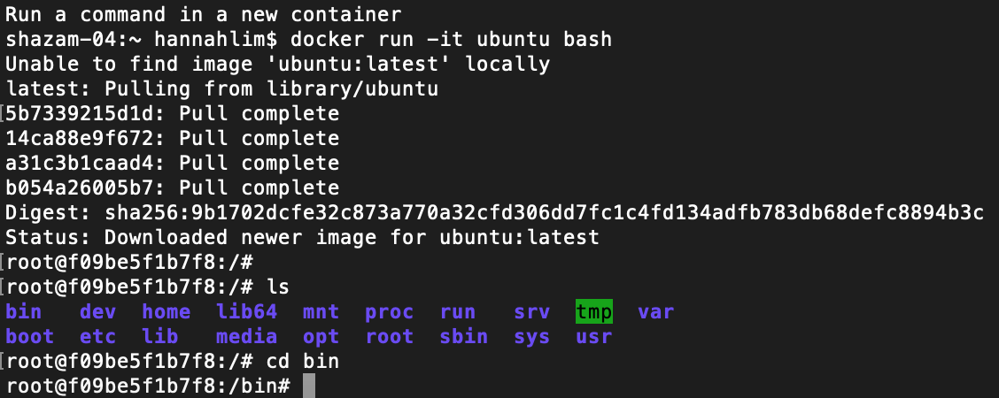
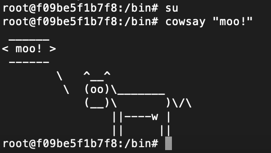
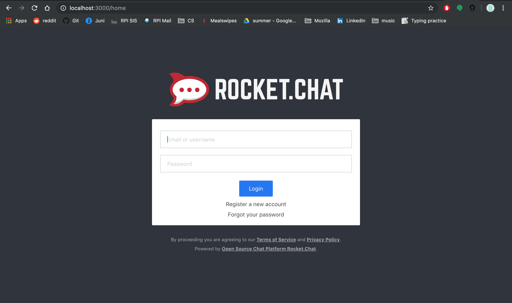
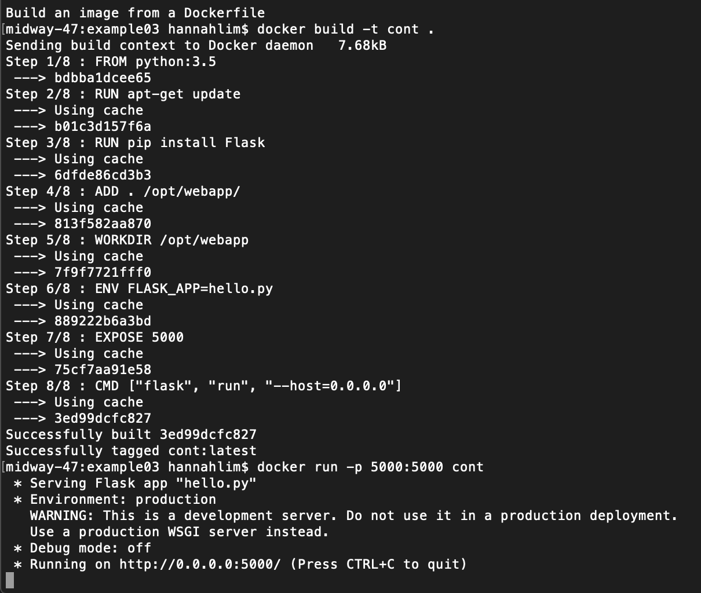
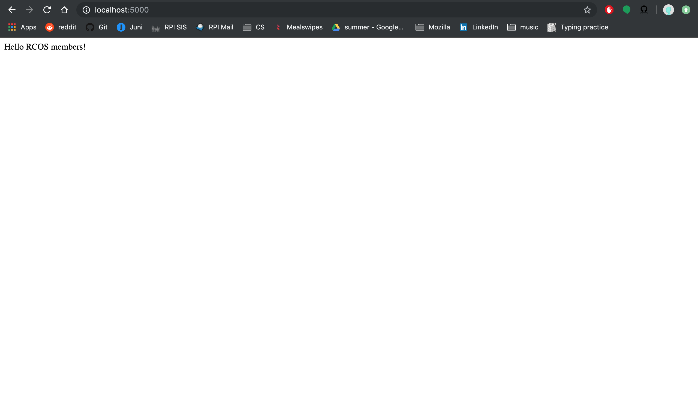
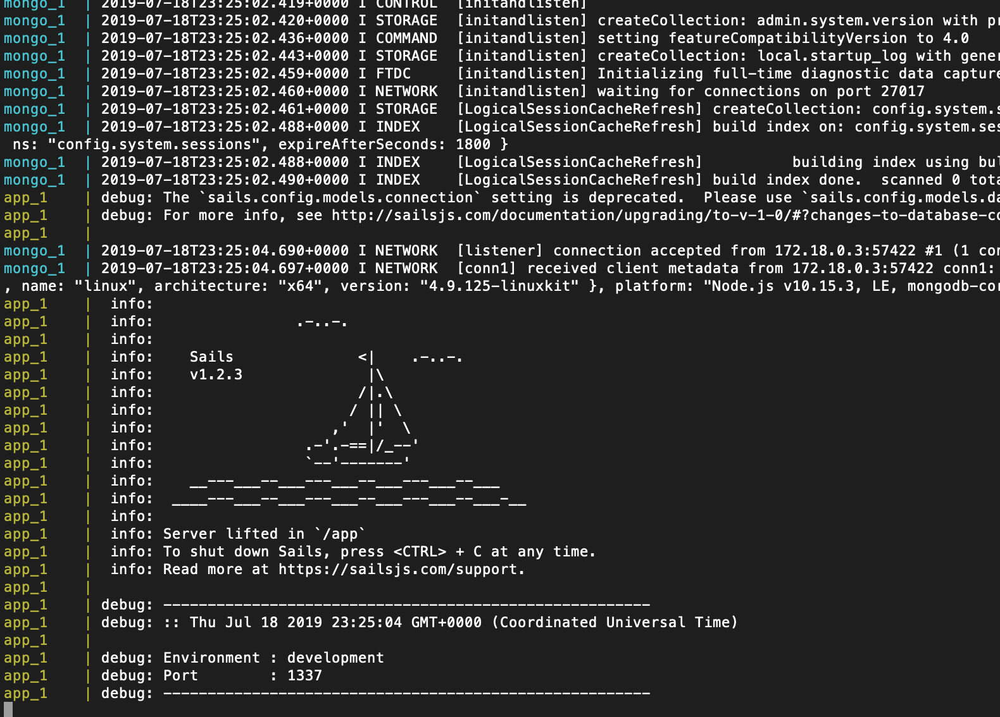
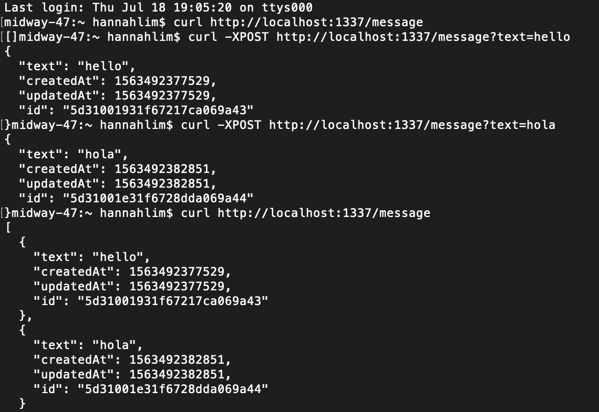

## Example 0

Step 0: Running docker and running whalesay

## Example 1

Step 1: Running ubuntu, vim, and cowsay

## Example 2

Step 2: Running rocketchat

## Example 3

Step 3: Running dockerfile

## Example 4

Step 4: Docker-compose

